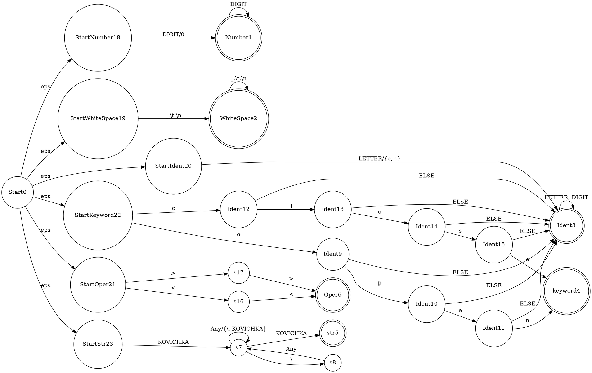
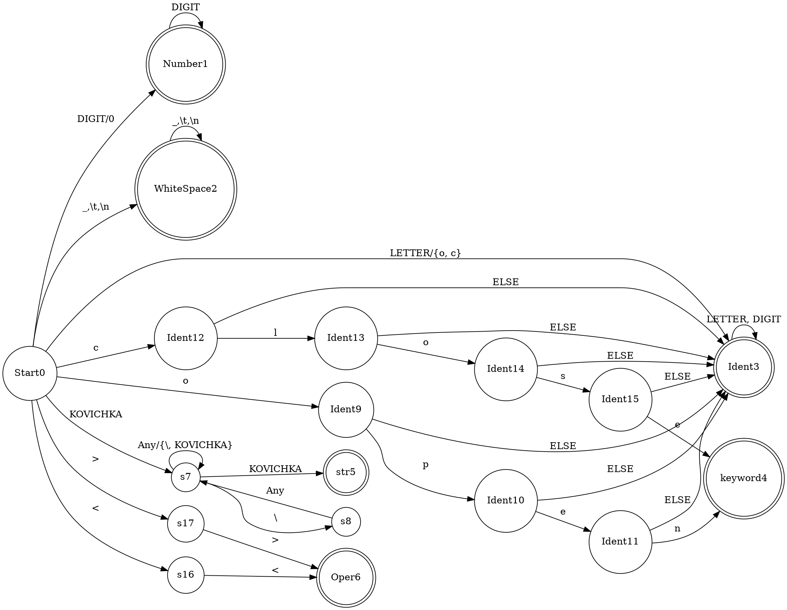

% Лабораторная работа № 1.4 «Лексический распознаватель»
% 11 марта 2024 г.
% Андрей Кабанов, ИУ9-62Б

# Цель работы
Целью данной работы является изучение использования детерминированных конечных автоматов 
с размеченными заключительными состояниями (лексических распознавателей) для решения 
задачи лексического анализа.

# Индивидуальный вариант
`open`, `close`, `<<`, `>>`, строковые литералы ограничены одинарными кавычками, для 
включения кавычки в строковой литерал она предваряется знаком `«\»`, могут пересекать 
границы строк текста.

# Реализация

Лексическая структура языка — регулярные выражения для доменов:

* `(DIGIT\0)(DIGIT)*` -> Number
* `(\n|\t| )+` -> WhiteSpace
* `open|close` -> Keyword
* `"(Any|\")*"` -> String
* `<<|>>` -> Operator
* `(LETTER\{o,c})(LETTER|DIGIT)*` -> Ident

Граф недетерминированного распознавателя:



Граф детерминированного распознавателя:



Реализация распознавателя:

Файл `main.py`:
```python
import string
class Coord:
    line = 0
    col = 0
    def __init__(self, line, col):
        self.line = line 
        self.col = col 
    def __str__(self):
        return f'(line={self.line} col={self.col})'

class Fragment:
    opening = None
    ending = None
    def __init__(self, opening, ending):
       self.opening = opening
       self.ending = ending
    def __str__(self):
        return f"(From {self.opening} to {self.ending})"
class Message:
    coord = None
    text = ''
    def __init__(self, coord, text):
        self.coord = coord
        self.text = text 
    def __str__(self):
        return f'(Error at {self.coord} {self.text})'

class  WhiteSpace:
    coords = None
    arg = ""
    def __init__(self, coords, arg) -> None:
        self.coords = coords
        self.arg = arg
    def __str__(self):
        return f"( WhiteSpace arg={self.arg} segment={self.coords})"
class Number:
    coords = None
    arg = ""
    def __init__(self, coords, arg) -> None:
        self.coords = coords
        self.arg = arg
    def __str__(self):
        return f"(Number arg={self.arg} segment={self.coords})"
class Ident:
    coords = None
    arg = ""
    def __init__(self, coords, arg) -> None:
        self.coords = coords
        self.arg = arg
    def __str__(self):
        return f"(Ident arg={self.arg} segment={self.coords})"
class StrLiter:
    coords = None
    arg = ""
    def __init__(self, coords, arg) -> None:
        self.coords = coords
        self.arg = arg
    def __str__(self):
        return f"(StrLiter arg={self.arg} segment={self.coords})"
class KeyWord:
    coords = None
    arg = ""
    def __init__(self, coords, arg) -> None:
        self.coords = coords
        self.arg = arg
    def __str__(self):
        return f"(KeyWord arg={self.arg} segment={self.coords})"
class Operator:
    coords = None
    arg = ""
    def __init__(self, coords, arg) -> None:
        self.coords = coords
        self.arg = arg
    def __str__(self):
        return f"(Operator arg={self.arg} segment={self.coords})"
class EOP:
    coord = None
    def __init__(self, coord) -> None:
        self.coord = coord
    def __str__(self):
        return f"(End of Program coord={self.coord})"

class Automata:
    def __init__(self, states, transitions, initial, accepting, mark):
        self.states = states
        self.transitions = transitions
        self.initial = initial
        self.accepting = accepting
        self.current_state = initial
        self.mark = mark
    def goto(self, state):
        self.current_state = state
    def is_initial(self):
        return self.current_state == self.initial
    def is_accepting(self):
        return self.current_state in self.accepting
    def get_mark(self):
        return self.mark[self.current_state]
    def current_transitions(self):
        return self.transitions[self.current_state]

def get_tokens(s, automata: Automata):
    pointer = 0
    line = 1
    col = 1
    len_automata = len(automata.current_transitions())
    is_yield = True
    panic = False
    opening = Coord(line, col)
    op_p = pointer
    history = [line, col, pointer]
    while pointer < len(s):
        if is_yield or panic:
            opening = Coord(line, col)
            op_p = pointer
        is_yield = False
        current_transition = automata.current_transitions()
        goto = False
        for state in range(len_automata):
            if s[pointer] in current_transition[state]:
                panic = False
                
                goto = True
                automata.goto(state)
                break
        if not (goto or automata.is_accepting() or panic):
            automata.goto(automata.initial)
            panic = True
            yield Message(Coord(line, col), "")
        elif not (goto or panic):
            
            obj = automata.get_mark()
            if obj is Number:
                yield Number(Fragment(opening, Coord(line, col)), s[op_p:pointer])
            elif obj is Ident:
                yield Ident(Fragment(opening, Coord(line, col)), s[op_p:pointer])
            elif obj is StrLiter:
                yield StrLiter(Fragment(opening, Coord(line, col)), s[op_p:pointer])
            elif obj is KeyWord:
                yield KeyWord(Fragment(opening, Coord(line, col)), s[op_p:pointer])
            elif obj is Operator:
                yield Operator(Fragment(opening, Coord(line, col)), s[op_p:pointer])
            is_yield = True
            automata.goto(automata.initial)
            continue
        if s[pointer] == '\n':
            line += 1
            col = 1
        else:
            col+=1
        pointer+=1
    if automata.is_accepting():
        obj = automata.get_mark()
        if obj is Number:
            yield Number(Fragment(opening, Coord(line, col)), s[op_p:pointer])
        elif obj is Ident:
            yield Ident(Fragment(opening, Coord(line, col)), s[op_p:pointer])
        elif obj is StrLiter:
            yield StrLiter(Fragment(opening, Coord(line, col)), s[op_p:pointer])
        elif obj is KeyWord:
            yield KeyWord(Fragment(opening, Coord(line, col)), s[op_p:pointer])
        elif obj is Operator:
            yield Operator(Fragment(opening, Coord(line, col)), s[op_p:pointer])
        elif obj is WhiteSpace:
            yield WhiteSpace(Fragment(opening, Coord(line, col)), s[op_p:pointer])
        is_yield = True
    if not(is_yield or panic):
        yield Message(Coord(line, col), "")
    yield EOP(Coord(line, col))


all_letters = list(string.ascii_letters)
all_digits = list(string.digits)
digits_nz = all_digits[1:]
white_spaces = [' ', '\n', '\t']
kovichka = ['"']
ecran = ['\\']
any = [chr(i) for i in range(128)]
any_nec = [i for i in any if i not in ecran and i not in kovichka]
all_let_dig = all_digits + all_letters
c = ['c']
l = ['l']
o = ['o']
s = ['s']
e = ['e']
p = ['p']
n = ['n']
any_nco = [i for i in all_letters if i not in c + p]
any_nc = [i for i in all_let_dig if i not in c]
any_nl = [i for i in all_let_dig if i not in l]
any_no = [i for i in all_let_dig if i not in o]
any_ns = [i for i in all_let_dig if i not in s]
any_ne = [i for i in all_let_dig if i not in e]
any_np = [i for i in all_let_dig if i not in p]
any_nn = [i for i in all_let_dig if i not in n]
left = ['<']
right = ['>']

initial = 0
accepting = [1, 2, 3, 4, 5, 6]
mark = {
    1: Number, 2: WhiteSpace, 3: Ident, 4: KeyWord, 5: StrLiter, 6: Operator, 
    9: Ident, 10: Ident, 11: Ident, 12:Ident, 13:Ident, 14:Ident, 15:Ident
}
trans = [[[], digits_nz, white_spaces, any_nco, [], [], [], kovichka, [], o, [],
           c, [], [], [], [], left, right],
            [[], all_digits, [], [], [], [], [], [], [], [], [], [], [], [], [], [], []],
            [[], [], white_spaces, [], [], [], [], [], [], [], [], [], [], [], [], [],
              [], []],
            [[], [], [], all_let_dig, [], [], [], [], [], [], [], [], [], [], [], [],
              [], []],
            [[], [], [], [], [], [], [], [], [], [], [], [], [], [], [], [], [], []],
            [[], [], [], [], [], [], [], [], [], [], [], [], [], [], [], [], [], []],
            [[], [], [], [], [], [], [], [], [], [], [], [], [], [], [], [], [], []],
            [[], [], [], [], [], kovichka, [], any_nec, ecran, [], [], [], [], [], [],
              [], [], []],
            [[], [], [], [], [], [], [], any, [], [], [], [], [], [], [], [], [], []],
            [[], [], [], any_np, [], [], [], [], [], [], p, [], [], [], [], [], [], []],
            [[], [], [], any_ne, [], [], [], [], [], [], [], e, [], [], [], [], [], []],
            [[], [], [], any_nn, n, [], [], [], [], [], [], [], [], [], [], [], [], []],
            [[], [], [], any_nl, [], [], [], [], [], [], [], [], [], l, [], [], [], []],
            [[], [], [], any_no, [], [], [], [], [], [], [], [], [], [], o, [], [], []],
            [[], [], [], any_ns, [], [], [], [], [], [], [], [], [], [], [], s, [], []],
            [[], [], [], any_ne, e, [], [], [], [], [], [], [], [], [], [], [], [], []],
            [[], [], [], [], [], [], left, [], [], [], [], [], [], [], [], [], [], []],
            [[], [], [], [], [], [], right, [], [], [], [], [], [], [], [], [], [], []]]
with open(r"test.txt", "r") as f:
    program = ""
    for line in f.readlines():
        program += line
    auto = Automata([i for i in range(len(trans))], trans, initial, accepting, mark)
    for token in get_tokens(program, auto):
        print(token)
```

…

# Тестирование

Входные данные

```
open << clos1
"ejafjsjfekesfk
adsffa" >> close
```

Вывод на `stdout`

```
(Ident arg=open segment=(From (line=1 col=1) to (line=1 col=5)))
(Operator arg=<< segment=(From (line=1 col=6) to (line=1 col=8)))
(Ident arg=clos1 segment=(From (line=1 col=9) to (line=1 col=14)))
(StrLiter arg="ejafjsjfekesfk
adsffa" segment=(From (line=2 col=1) to (line=3 col=8)))
(Operator arg=>> segment=(From (line=3 col=9) to (line=3 col=11)))
(Ident arg=close segment=(From (line=3 col=12) to (line=3 col=17)))
(End of Program coord=(line=3 col=17))
```

# Вывод
При выполнении лабораторной работы был разработан лексический распознаватель, было 
изучено: создание регулярный выражения для токенов, построение по этим регулярных 
выражения автомата и его детерминизация, а также представление этого автомата 
в программе.